# yaxc

`yaxc` — Android-клиент для `Xray-core` с упором на удобную повседневную работу: импорт профилей и подписок, маршрутизация приложений и ядра, управление runtime-ресурсами, диагностика и современный интерфейс на Jetpack Compose.

Проект развивается как самостоятельный форк с отдельным именем пакета, собственной UI-архитектурой и независимым release cycle.

## Что умеет приложение

- Подключение к `Xray-core` через локальный VPN-интерфейс на Android.
- Защита tun0 через ConnectivityManager (Android 10+)
- Импорт профилей из:
  - JSON-конфигов
  - подписок
  - QR-кодов
  - буфера обмена
- Управление источниками и профилями:
  - обновление подписок
  - переименование и удаление
  - пакетный и одиночный пинг
- Маршрутизация приложений:
  - режим исключения приложений из VPN
  - режим включения только выбранных приложений
- Маршрутизация ядра:
  - визуальный редактор правил
  - JSON-редактор
  - импорт и экспорт правил
- Управление runtime-ресурсами:
  - `geoip.dat`
  - `geosite.dat`
  - выбор источника геобаз
- Настройки подключения и диагностики:
  - DNS IPv4 / IPv6
  - `tun2socks`
  - локальный SOCKS5
  - `User-Agent`
  - выбор типа пинга
- Локализация интерфейса:
  - русский
  - английский
  - системный язык
- Несколько тем оформления, включая светлую и темные схемы.

## Для кого это

`yaxc` подойдет, если нужен Android-клиент для Xray без лишней перегруженности, но с доступом к продвинутым возможностям:

- обычное подключение по готовым профилям
- работа с подписками
- разделение трафика по приложениям
- ручная настройка routing-правил ядра
- отладка и диагностика прямо в приложении

## Скриншоты

### Основной экран и разные темы

Так выглядит основной экран в разных темах. Тема меняется в настройках.
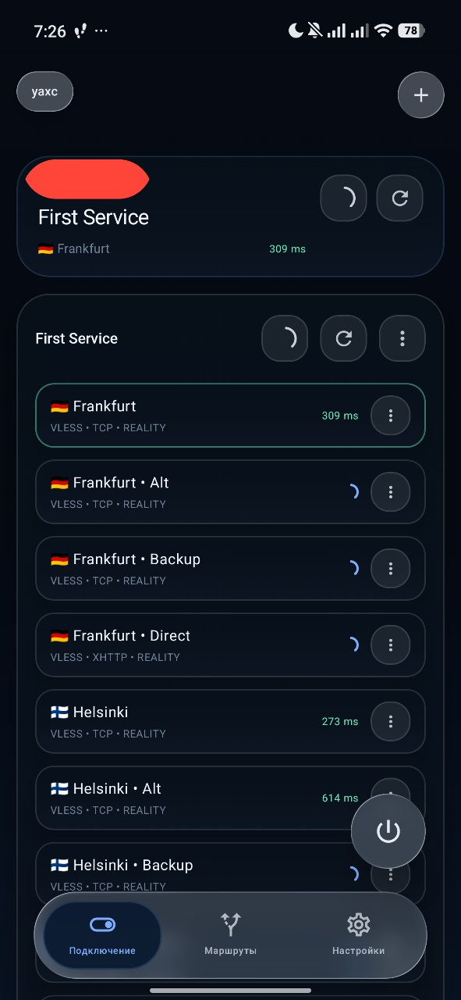
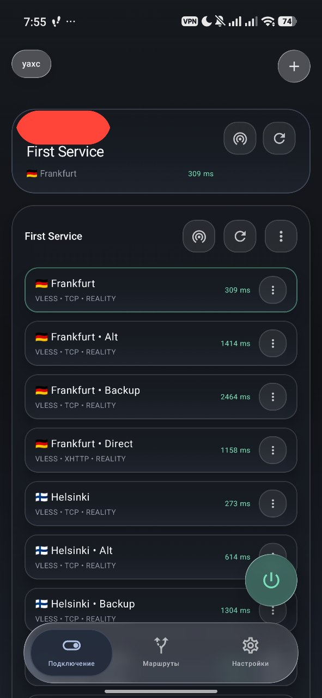
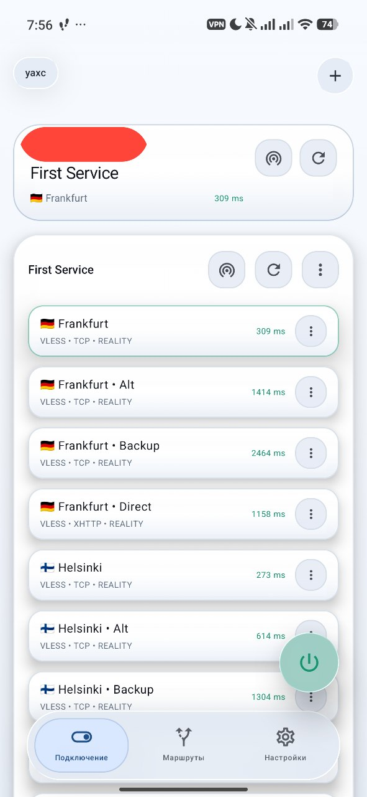

### Маршрутизация
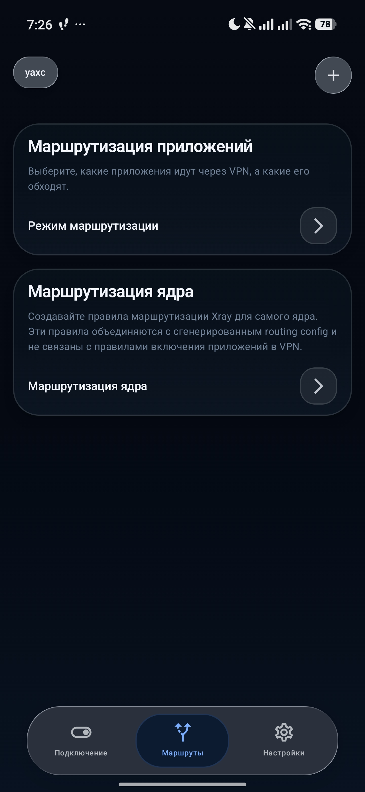

Эти правила добавлены изначально, они сразу будут включены после установки приложения, чтобы пользователю не надо было заморачиваться со стандартной маршрутизацией. **Порядок правил имеет влияение: чем выше правило, тем раньше оно будет выполнено. Правила можно перемещать между собой** 
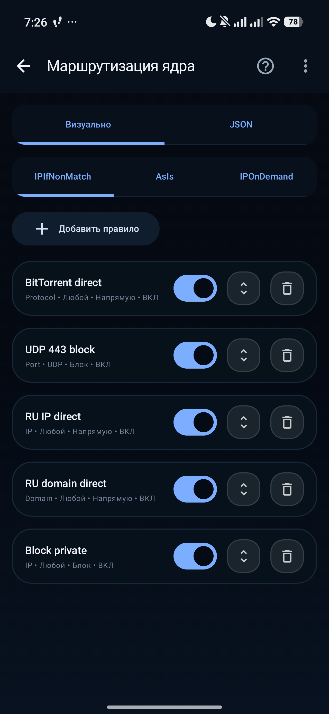
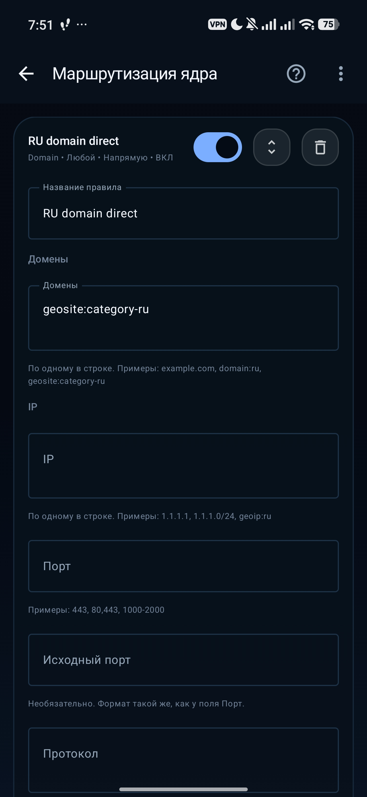
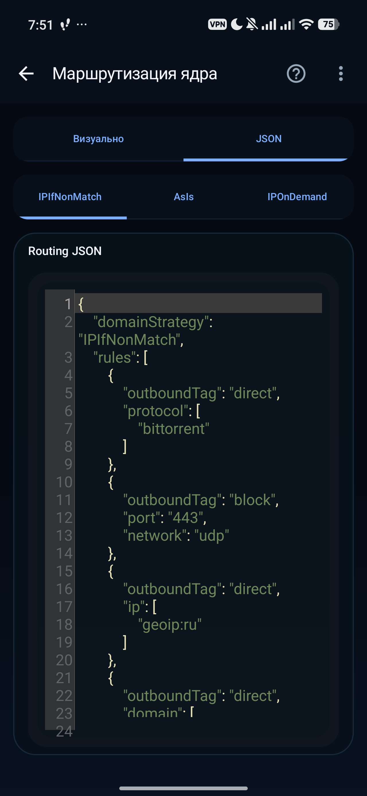
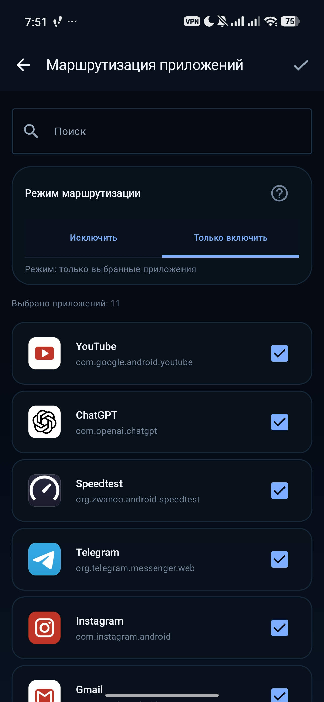

### Настройки
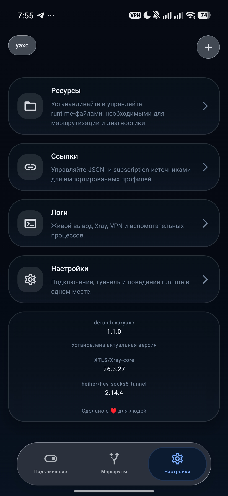
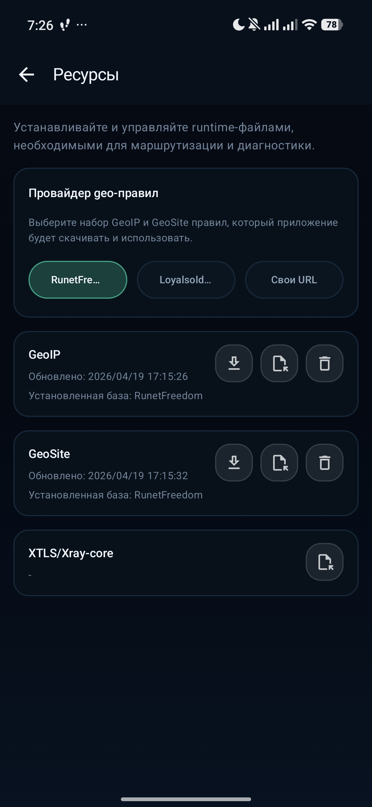
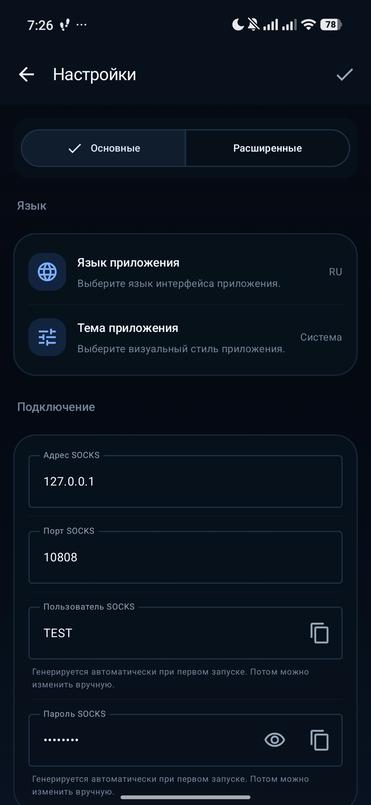
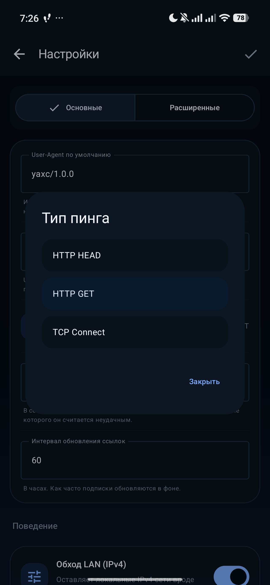

## Установка

1. Открыть [Releases](https://github.com/derundevu/yaxc/releases) и выбрать последний стабильный.
2. Скачать APK под свою архитектуру устройства.
3. Установить приложение на устройство.

Если не знаешь архитектуру устройства, обычно подойдет:

- `arm64-v8a` для большинства современных Android-устройств

## Быстрый старт

После установки типичный сценарий такой:

1. Добавить подписочную ссылку (*с отдельными конфигами приложение работает еще нестабильно*).
2. Выбрать профиль.
3. При необходимости проверить пинг.
4. Скачать ресурсы в Настройках -> Ресурсы. Без этого не будет работать маршрутизация ядра, которая сразу завязана на правила `geoip:ru`, `geosite:category-ru`.
5. Запустить VPN.

## Статус проекта

Проект активно перерабатывается и развивается. В репозитории уже есть:

- собственный Compose-интерфейс
- обновленный release pipeline
- отдельная система тем и локализаций
- своя логика маршрутизации и работы с ресурсами

При этом это все еще живой проект, в котором интерфейс и внутренние механизмы продолжают дорабатываться.

## Локальная сборка

Короткий сценарий для debug-сборки на macOS:

```bash
export JAVA_HOME="your-path"
export PATH="$JAVA_HOME/bin:$PATH"

git submodule update --init --recursive

./buildXrayCore.sh arm64
./buildXrayHelper.sh arm64

GRADLE_USER_HOME=/tmp/gradle-user-home ./gradlew :app:assembleDebug
```

## Происхождение проекта

`yaxc` основан на форке проекта [SaeedDev94/Xray](https://github.com/SaeedDev94/Xray), но развивается как отдельное приложение с собственным интерфейсом, настройками, релизами и внутренними изменениями. За основу взята интеграция с API системы и xray-core.

## Лицензия

Проект распространяется по лицензии MIT.
